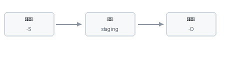

# 静态资源

源目录中除 `.md` 外的文件会原样复制到构建工作区，并随站点发布。

> 演示页使用 `static-files.md` 作为文件名，避免 URL 为 `/…/assets/` 与站点主题目录 `/assets/` 冲突。

## 示意图

下方为 `media/diagram.png`：



## 相对路径

在 Markdown 中使用相对路径引用图片、PDF、下载包等：

```markdown

[下载示例](media/sample.txt)
```

## 文本附件示例

同目录 [sample.txt](media/sample.txt) 可作为「可点击下载的静态文件」演示（浏览器可能直接打开文本）。

## 注意

- 资源路径相对于当前 `.md` 文件。
- 修改图片后，`watch` 会检测非 Markdown 文件变更并触发重建。
